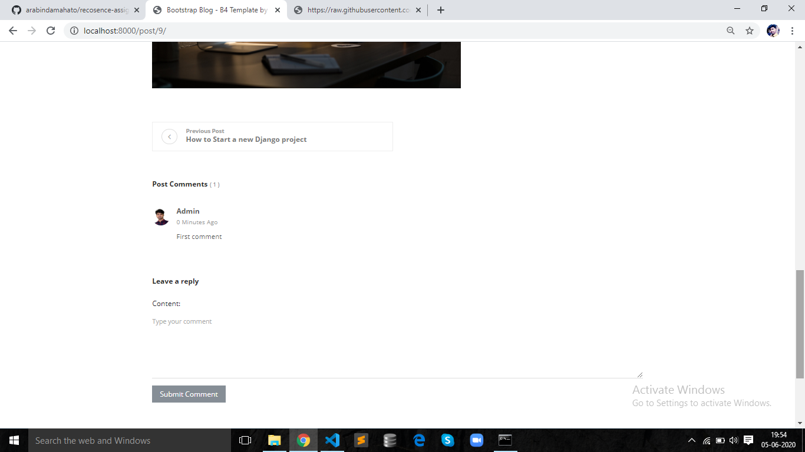

# recosence-assignment

## If you want to run this project in your system please follow the steps below :
 
1. Create a virtual environment in your system and activate that .
2. Clone this project.
3. Run the Requirements.txt (pip install -r requirements.txt) .
4. Run the migrations.
5. create superuser for accessing admin panel.
6. Run the Django Server.

7. `After successfully running server please follow the given url and screenshots for better clarification.`

##### Homepage  :
- http://localhost:8000/

###### Screenshot

 

##### Blog List View  :
- http://localhost:8000/blog/

###### Screenshot

 

##### Signup for creating a blog post  :
- http://localhost:8000/accounts/signup/

###### Screenshot

 

##### Login to create a blog post  :
- http://localhost:8000/accounts/login/

###### Screenshot

 

##### Post Detail View  :
* `If you want to update or delete any post you must go to the detail view.`
- http://localhost:8000/post/9/

###### Screenshot

 

##### If you find [ 'AnonymousUser' object is not iterable ] Error during update or delete operation. Then please login to update or delete :

- http://localhost:8000/post/9/

###### Screenshot

 

##### Create Post  :

http://localhost:8000/post/create/

###### Screenshot

 

##### Update Post  :

http://localhost:8000/post/update/

###### Screenshot

 

##### Comment :
* ` If you want to comment anything then click the below url but make sure you are login`

http://localhost:8000/post/9/
###### Screenshot

 

##### Logout :

http://localhost:8000/accounts/logout/
###### Screenshot

 

# Subscribe :
* `If you want to get notification from every post then please subscribe`

http://localhost:8000
###### Screenshot

 

